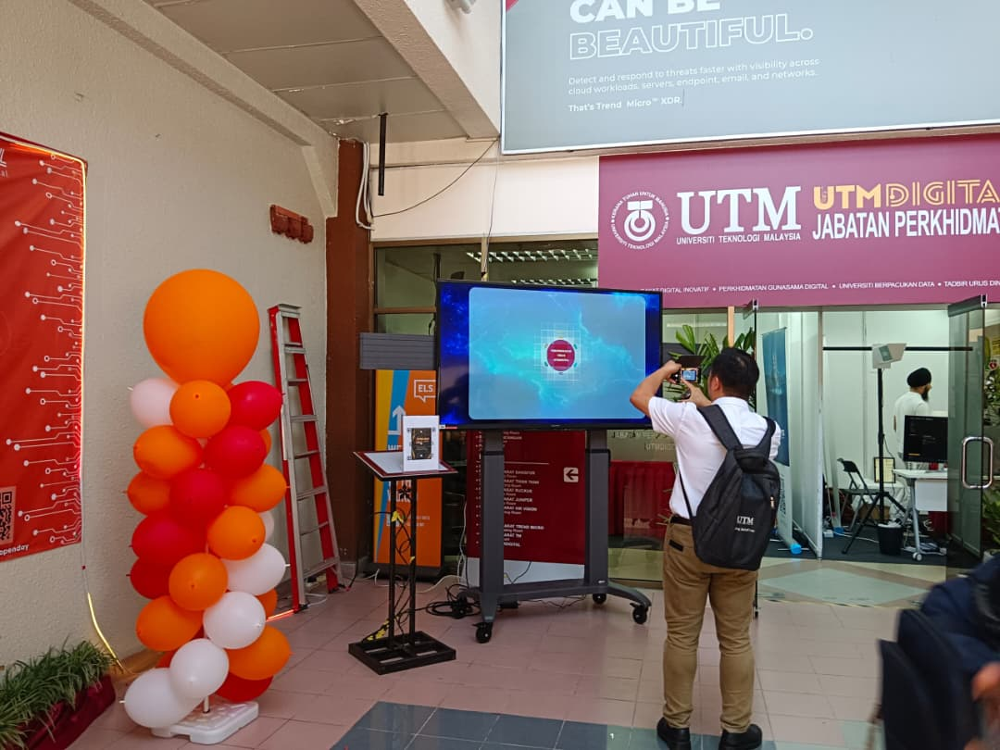
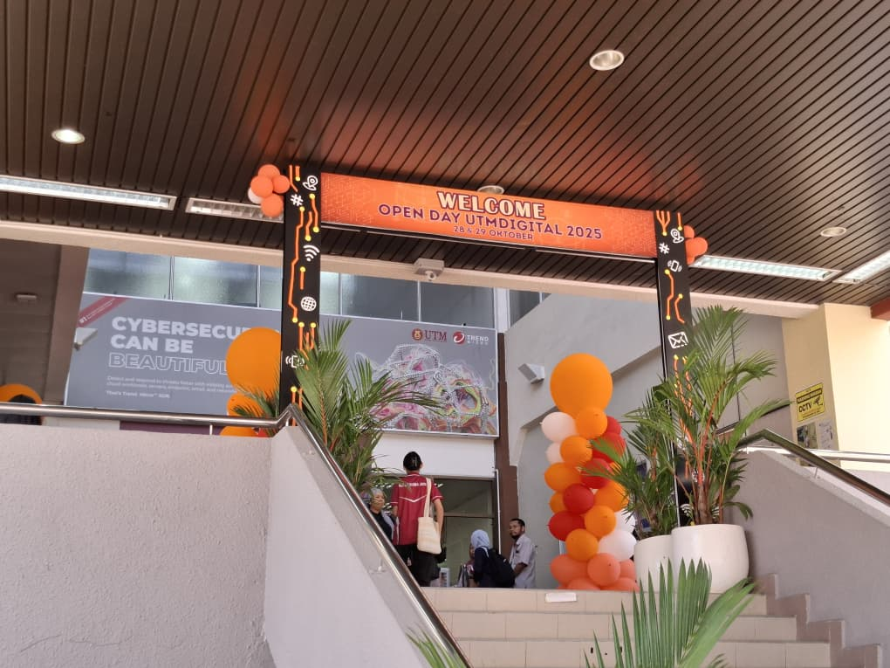
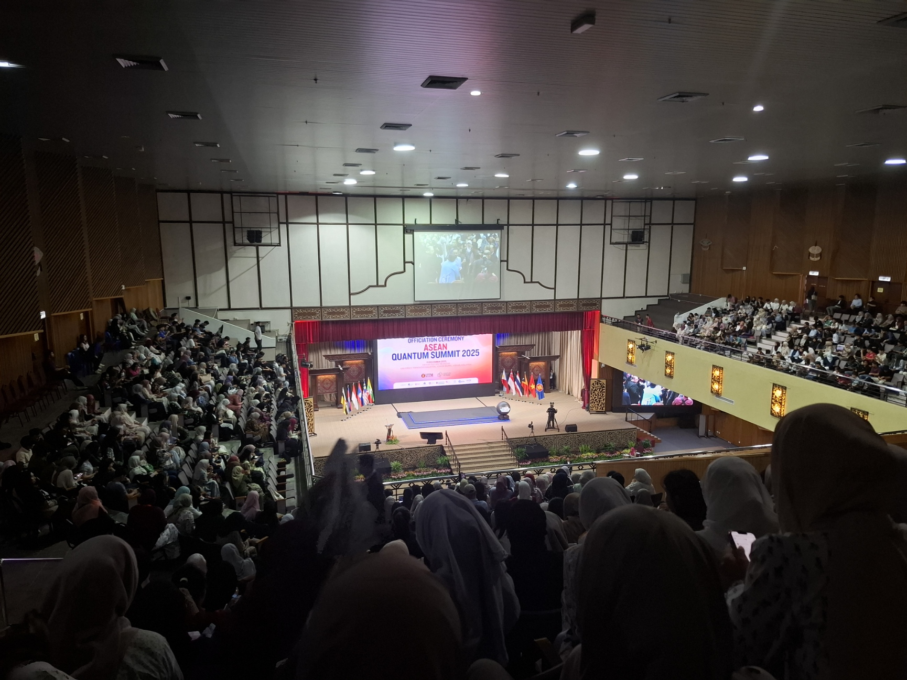
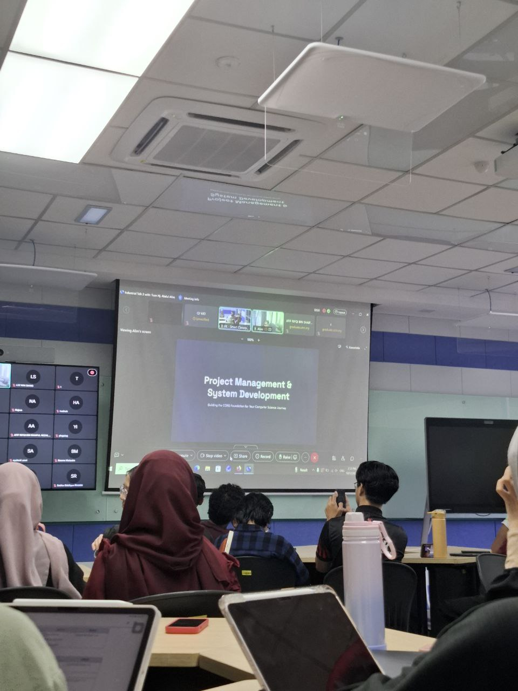

## ABOUT ME
HELLO!! 👋👋 

I am a 1st year student | Bachelor in Science Computer (Data Engineering) with Honours | University Technology Malaysia (UTM) 😎🤗. 

## SKILLS

*I have been studying coding using:-*

**-✅ Java**

**-✅ C++**

## MY PORTFOLIO
✨*TECHNOLOGY AND INFORMATION SYSTEM*

◾*Industry talk 1*

I had the oppurtunity to attend the talk at UTMDigital Open Day. I got a lot of new knowledge by attending the talk. We also have an assignment to create a video based on the attended talk.

<a href="https://www.linkedin.com/feed/update/urn:li:activity:7394652030339829760/">You can see what I have attended by clicking on this.</a>

◾*ASEAN Quantum Summit*

-Report

<a href="Report Quantum.pdf">Download the report here (pdf.file)</a>

◾*Design Thinking Project*

About mental health insight of UTM students. Based on this project I learn on find the problem and the solution. It also enhance my critical thinking and social skills.

<a href="">Video</a>

<a href="">Report</a>

◾*Industry talk 2*

Learn about project management and system development by Ts. Hj. Abdul Alim bin Mutallib

<table>
  <tbody>
    <tr>
      <td>Report</td>
      <td><a herf=" ">Assignment 3 (Group 5)</a></td>
    </tr>
  </tbody>
</table>

✨*PROGRAMMING TECHNIQUE*

◾*Group Assignment 1*

Group assignment where we need to draw a flowchart for the solution. I can fully understand on how to build flowchart for user defined function using a modular.

<a href="Assignment1.drawio.pdf">Read more</a>

◾*Group Assignment 2*

Make a coding based on the output that has been given using c++. There's 2 set and we need to choose 1 set to answer.
We choose set 2 to answer the question. I got to enhance my skill using user defined function and output formating by using manipulators.

<a href="Assignment2.pdf">Question</a>

<a href="Assignment2.cpp">Read more</a>

◾*In Class Exercise*

We use an array for the program. I can practice my skills of the array in coding. 

![image]Screenshot 2025-12-30 164259.png

<a href="program1.cpp">Program 1</a>

<a href="Program2.cpp">Program 2</a>

✨*DIGITAL LOGIC*

◾*Lab 2*

We use deeds app to get the output. I got to understand to get boolean expression through k-map based on the output that has been obtained.

<a href="Lab 2.pdf">The question and answer of it</a>

<a href="LAB 2 (Part 1).pbs">Logic circuit for part 1</a>

<a href="LAB 2 (Part 2).pbs">Logic circuit for part 2</a>

✨*DISCRETE STRUCTURE*

◾*Group Assignment 2*

We try solving all the question and compare each other answer. I got to enhance my critical thinking by solving all the question.

<a href="Assignment 2 Chapter 2.pdf">Question</a>   

<a href="group6.pdf">The answer</a>

## CONTACT DETAILS
*Let's connect and see how we can make difference together*
<table>
  <tbody>
    <tr>
    <td>📨</td>
    <td><a href="mailto:nanaadlina06@gmail.com">nanaadlina06@gmail.com</a></td>
    </tr>
    <tr>
      <td>📲</td>
      <td>(+60) 19-593 0575</td>
    </tr>
    <tr>
      <td>📍</td>
      <td>Perak, Malaysia</td>
    </tr>
    <tr>
      <td></td>
      <td><a href="https://www.linkedin.com/in/nur-fariza-adlina-binti-mohammad-faizal-64169b344/">The things I do daily on LinkedIn</a></td>
</tr>
    <tr>
      <td></td>
      <td><a href="https://github.com/FarizaAdlina">My project and assignment</a></td>
    </tr>
  </tbody>
</table>

